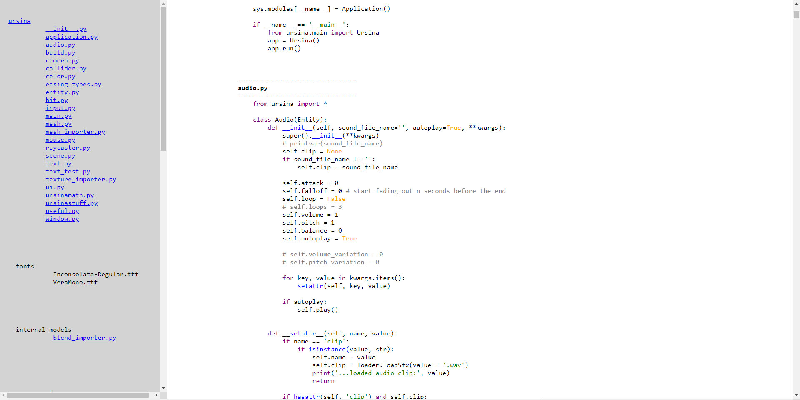

# codebrowsergen

Generate a static website for easy viewing of your code or documentation.
Colors python code.

## How to

    python -m codebrowsergen title(optional)

This will combine all the text files in the folder into one html document.
